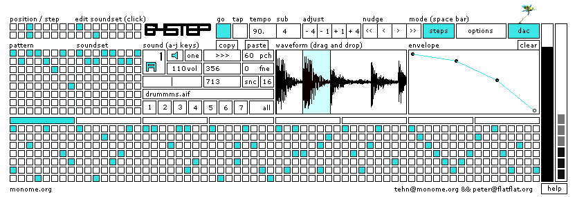

#64step

**written by Peter Segerstrom**

64step is a versatile sequencer/sampler designed for tight integration with the monome 40h. it is a more complete realization of [[step]]. please write peter a t flatflat.org for bugs.

**WARNING: DOES NOT WORK IN MAX 7**