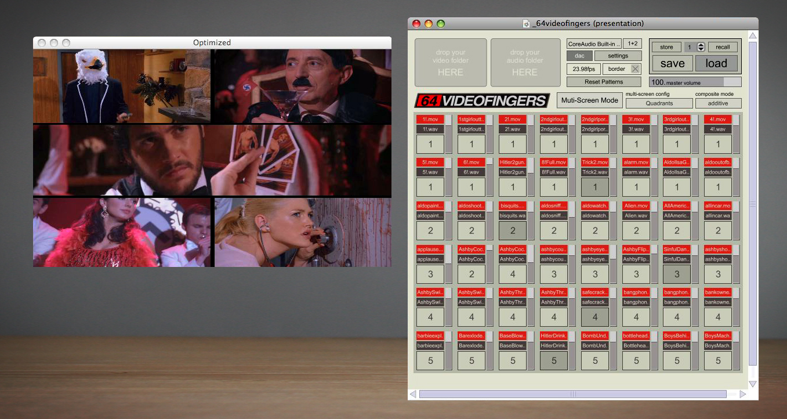

# 64videofingers

created by: egon77

## DESCRIPTION

64 Videofingers is a live performance app designed for making music out of video clips.  You can play all the video clips live or you can layer them using the four pattern recorders.  Be sure to check out the manual for more detailed information.

You will also need to install the v001 shaders (designed by vade) in order to get the composite modes working.  You can find the download link and install instructions here: http://001.vade.info/?page_id=6

https://vimeo.com/6255134