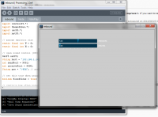

# Rebound

created by: josh g. - josh (a) thoughtlost.org

A Processing-powered MIDI instrument for monome.  Notes bounce across the grid, occasionally changing directions.

Rebound creates moving nodes which bounce horizontally across the grid, then occasionally change direction.  MIDI notes are triggered when the node is first pressed, and then on every bounce against the outside edge.  The nodes decay after a variable amount of time.  The average lifespan of the nodes and the average frequency of direction-changes can be controlled via an on-screen slider or mapped to an OSC slider (via some hacking).  To clear the grid, press and hold the top left button for a second and release.

The app was created and tested using an emulator, not a for reals monome, and as such might need some tweaking to get it up and running with your config.  However I've tried to keep the important constants up front and at the top of the first file you see when you open the code so it shouldn't be too painful.

For anyone trying it out on the Control monome emulator, the chaosLevel and lifeLevel sliders are mapped to the emulator's two sliders.

Installation:
If you don't have it yet, go download Processing 2.0 or greater and install it.
This program also requires the controlp5 and midibus libraries.  Download them at:
http://www.sojamo.de/libraries/controlP5/
http://www.smallbutdigital.com/themidibus.php

and copy them to the 'libraries' folder where your Processing sketches are saved.

Once those libraries are in place, unzip the Rebound app files somewhere and load rebound.pde in Processing.  The app should run without any errors, although it may not connect right away - scroll down a little to see if you need to change the IP address or port numbers for your OSC setup.

I've mostly used this as an 8x8 grid setup, but the grid dimensions are set as constants that you can change at the start of the file too.  (Although I think it'll run out of MIDI notes in the table if you run it at 16x16.)

The 'NotePlay' class contains the mapping from grid locations to MIDI notes, among other things.  If you want to modify the scale being played, you can either edit the table at the start of that file to a new MIDI mapping ... or be creative and just rewrite stuff. :)

Licensed under Creative Commons Noncommercial Share Alike.

http://www.ustream.tv/recorded/23146439