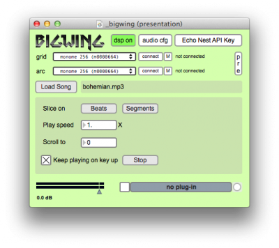

#bigwing

created by: dewb

automatic whole-song beat/segment slicer
for hands-on remixing with grid and optional arc
using the Echo Nest analyzer API

http://dewb.org

bigwing maps all the beats of a single song to all the keys of a grid controller. beats are automatically detected using the Echo Nest analyzer web service. arc encoders can be used to scroll through the song, control playback/loop speed, volume, etc.

in addition to slicing a song by beats, you can also slice it into "segments", which in Echo Nest parlance are the smallest block of analysis, a short entity uniform in timbre and harmony. this can enable some resynthesis-like fun.

notes
* Requires Max 6 / serialosc / OS X 10.6+
* currently requires an Echo Nest API key (free) and a network connection
* bigwing was designed to take full advantage of a 2012 16-level varibrightness 256 and arc4. Smaller grids and arcs will work fine.  If you lack varibrightness or an arc, the experience won't be as awesome, but with bigwing 0.2 all functions should be accessible.
* a modified version of en_analyzer~ built for Max6/OSX 10.6+ is included in the patch folder.  Max will load it from this location; it is recommended that you NOT copy it into the Max folder, as it's still unstable. Windows users, see note below.
	

setup
* go to http://developer.echonest.com and sign up for a free account
* run bigwing
* click "Echo Nest API key" and add your API key (it's the first string of numbers and letters on your account page here https://developer.echonest.com/account/profile)
* API key will be saved in future sessions

how to use
* open the Max messages window.
* load any song under 40MB (wav, mp3, m4a ok.) this will freeze Max for a while while it uploads the track and waits for analysis. 
* check the Max messages window for a successful analysis result. it's likely that the analysis will fail the first time. try loading the same song again and it should succeed quickly.
* press any grid button to start playing the song from that position
* hold down a button to loop that beat or segment
* click "beat" or "segment" to change the slicing mode
* arc encoder 0 controls speed
* arc encoder 1 scrolls through the file (if it has more than 256 beats/segments)
* arc encoder 2 is reserved for future use
* arc encoder 3 controls volume
* uncheck "keep playing on key up" for a more synth-like experience. 

media
* <html>video coming when it's closer to 1.0</html>

known issues & future enhancements
* bug: glitches in current song position indicator on grid & arc LEDs 
* bug: long pauses or crashes during upload (need to make analyzer call non-blocking)
* move from groove~ to xgroove~, add pitch lock
* in segment mode, use loudness/timbre/pitch data to shade the background
* external clock sync, recognize non-4/4 songs
* add preset storage/recall so already-analyzed songs don't need to hit the web
* for songs with a short intro bar, use section analysis and/or add a "beat offset" user control to align beat 1 on the right side of the grid
* add sequencing features
* use encoder 2 for swing/filter/???
 
running on windows/linux
* the modified en_analyzer~ has only been built for OS X 10.6+.  It should be feasible to adapt it to Windows/Linux.  There is an existing Visual Studio project to build the analyzer against Max 5. Dependencies include libjson-c, libsndfile, and libcrypt. code is here: http://github.com/dewb/en_analyzer

bigwing was created for Music Hack Day Boston 2012.
* [[https://www.hackerleague.org/hackathons/music-hack-day-at-mit/hacks/bigwing]]

inspired by Paul Lamere's MHD Boston 2011 project "Bohemian Rhapsichord":
* http://static.echonest.com/BohemianRhapsichord/index.html (requires Chrome)
