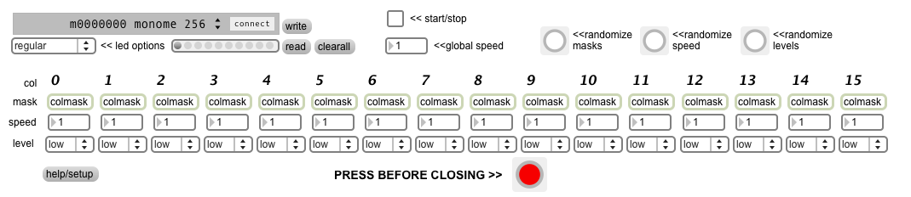

# Bit Rain

created by: ** 2D10 **

This patch was inspired by the http://vimeo.com/290706 video by tehn.

For any questions, comments, suggestions etc. please post on the monome forum thread:

## SETUP

* Connect monome to serialosc
* Select led option (regular or discreet)
* Double click on colmask boxes to make a column pattern
* Pick individual or global speeds
* //Choose column levels if using discrete level device//
* Click start/stop toggle

## SAVING

To save a pattern in the preset box (grey thing with little circles), hold shift and click on a circle.

* To save the presets to a file click on write.
* To load a saved file click read.
* To clear the presets click clear.
  
## IMPORTANT

* Click the red button before closing the app or disconnecting the monome.

(Newer devices seem to remember the individual state of the led level and appear to carry them over to other apps. clicking this will return then to full level and clear the monome leds.)// 

http://vimeo.com/290706