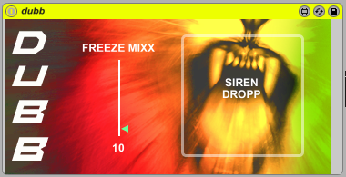

# dubb

dubb is an effect plug-in, for creating spacey, dubbed-out soundscapes

created by: pewt

I haven’t seen that many monome patches that incorporate effects and live processing (though there are some really awesome ones, like DJFX), so I thought it would be fun to make a performance oriented delay/reverb patch.

Since acquiring a second monome, I’ve realized the benefits of having an entirely effects oriented patch- kind of a secondary patch to compliment a set of samples or a midi instrument controlled by another monome. 

I’ve added a bunch of different features to dubb, with the overriding philosophy that it should be playable, simple, and operable (almost) entirely from a single monome 64. A lot of the stuff I’ve added is locked to a certain value: for example, the low pass button cuts only to 700hz. Feel free to open up dubb and edit to taste- the patch is pretty simple I think.

That said, this is also my first Max patch to involve sound processing as well as control- let me know if there are any weird kinks.

I also want to thank my friend Jonathan Moran, from jm-dsgn.com for helping me with the artwork.

PS: I included a couple possible sirens with the download- feel free to use them (one is from freesound.org, the other is my moog)

http://vimeo.com/20044017
