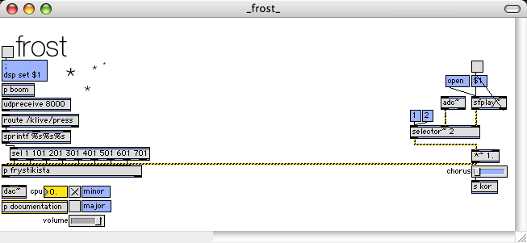

#frost

created by: dataplex

**frost is an max/msp/jitter patch that's great for making harmonious soundscapes on the fly.**

**from the documentation**

* each first row cell will freeze a spectral window of whatever passes through, resulting in a continuous spectral representation of the original signal.

* column buttons will pitch shift the frosty drone captured before.

* due to cpu overload on my machine, the first and last columns are monophonic...

http://www.vimeo.com/klive