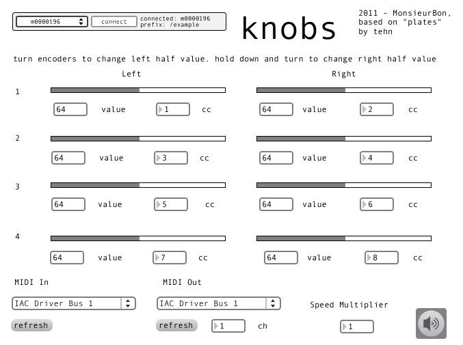

# knobs

created by: MonsieurBon.

A simple arc-to-midi knob converter/doubler.

Using an arc 2 or 4, you can double the available knobs and output that data to MIDI. Turning the encoder moves an indicator on the left side. Pushing and holding and turning the encoder moves a double indicator on the right side. You can adjust the turning speed multiplier for faster knob-doodling.

I built this to use with my generative Ableton Live sets. Video to come...

Added bonus: if you send MIDI note data to whatever you have selected as "MIDI in" in knobs, the notes will flash on the encoder LEDs, scaled to velocity. MIDI channels 1-4 are mapped to knobs 0-3.

Also, knobs can have your arc display incoming MIDI data if you route CC data through MIDI in. The CC in mappings are static at this point, and correspond to the default CC values in knobs.
