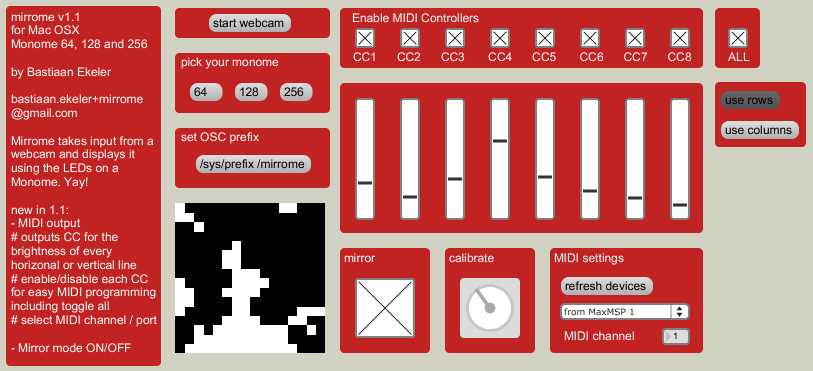

# Mirrome

created by: Bastiaan

It basically displays everything your webcam sees on your beautifully low-res monome screen. Mirrored. So you can use it to check your hair or put on makeup or something.

It should work with the 40h/64/128/256 But I've only tried it on my Arduinome 64. Also, it may only work on OSX in Max5 but I think that's what most people use anyway so there.

https://www.youtube.com/watch?v=j67BZ9CKLCI