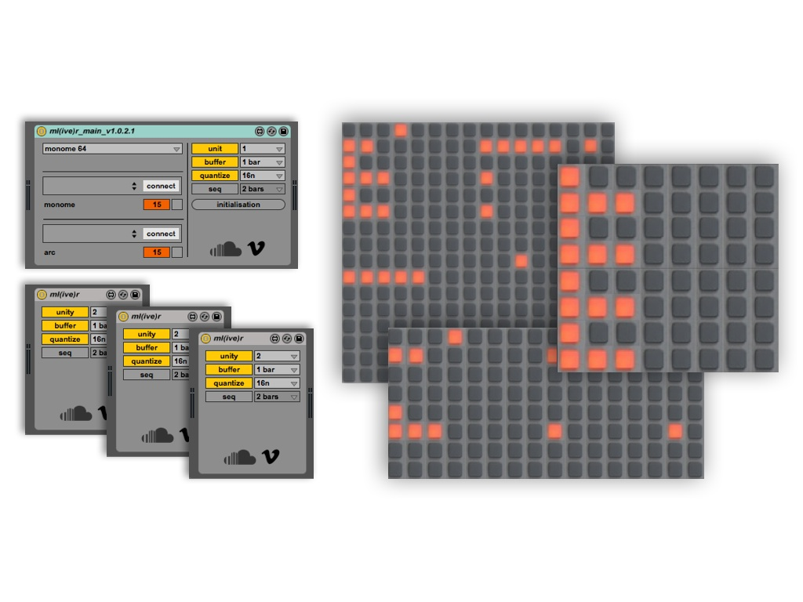

# ml(ive)r

ml(ive)r is an adaptation of Tehn's mlr for Ableton Live (Max For Live).
It allows to play in mlr style directly with the Live audio clips (also allows to play reverse and stutter processing).

For Monome 64, 128 and 256.

Arc 2 and 4 are optionnal (allows to play in scratch style).

created by: alexaugier

Thanks to Karaokaze and Galapagoose for the incredible support.

http://vimeo.com/73208238