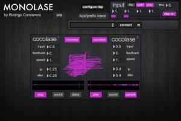

#Monolase

created by: [Rodrigo Constanzo](http://www.rodrigoconstanzo.com)
based on Cocolase by [ciat-lonbarde](http://www.ciat-lonbarde.net)

8-bit modulated delay/sampler based on the ciat-lonbarde Cocolase.

**Features:**

Two 8-bit sampler/delays being modulated by a "Sidrassi" brain, consisting of five oscillators which can be audiorate or LFO, and triangle or square.
These modulation sources can be patched to different parameters (as well as each other) to create complex patterns. There are an additional three "rambrains" which are some of the oscillators sampled at the rate of other oscillators, for even more complex waveforms.

Each delay/sampler has control over input, feedback, and pitch. You can patch the modulation sources to "flip" which controls playhead direction, "skip" which controls playhead position, and "afec" which controls playback speed.

**Instructions:**

Top Row are modulation sources. They are variable
rate oscillators that can be LFOs or audio rate and triangle or square.

They can be patched to themselves or to various parameters of each cocolase module. The parameters are "flip" (changing direction), "skip" (jumping position) and "afec" (playback speed).

You can adjust the "ip" to control how much flip/skip are effected, and "afec" to control how much the speed is effected.

* Rows 2-7 are the parameters for modulation.
* Row2 - flip for cocolase2
* Row3 - flip for cocolase1
* Row4 - skip for cocolase2
* Row5 - skip for cocolase1
* Row6 - afec for cocolase2
* Row7 - afec for cocolase1

Row8 contains the playback controls. These are two identical sets of 4 buttons.

* Button1 - cocolase engage
* Button2 - play/stop
* Button3 - sound/silence
* Button4 - delay/sample

The sound and functionality are modeled after the hardware Cocolase (which I own) and it would help to read the manual linked below to get a handle on the device a bit more.

http://vimeo.com/34830353
