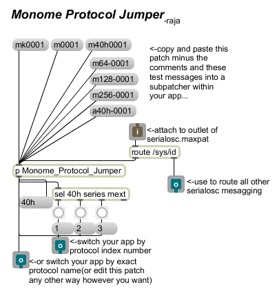

#Monome Protocol Jumper

created by: raja

A max patch for devs to use in their apps, given connection of device to serialosc.maxpat, to route /sys/id (serial-number) to appropriate monome protocol selection: 'mext', 'series', or '40h'; allowing devs to cater their app to the capabilities of different devices.

