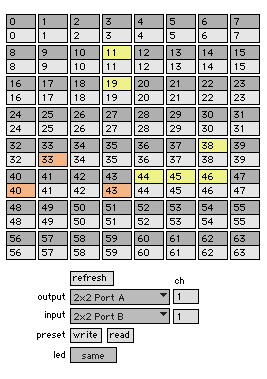

# monome base

a collection of various max/msp patches including:

    basic test patch
    midi routers (multi-mode, virtual sliders, etc)
    various vu audio-visualizers
    prefix routing tools
    osc howto patches (primer to writing your own patches)
    serial howto patches (making sense of the protocol without monomeserial)

