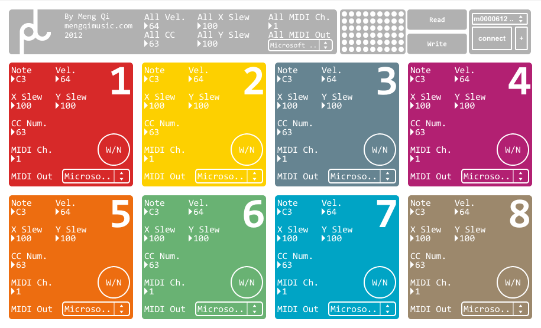

# pad

created by: [Meng Qi](http://mengqimusic.com)

multiple xy pad midi controller for monome grid

This app is intented to be used for 128 (64 should work too) as multiple xy pads.
Each 4x4 section is a pad.
You can set the note, velocity, xy CC number, xy slide rate, midi ch and output port separately for each pad.
Also there is a "control all" section for easy editing.
