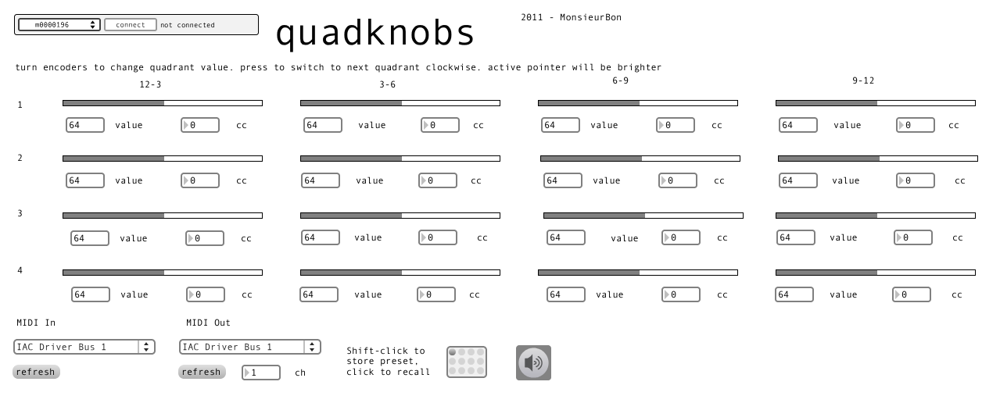

# quadknobs

created by: MonsieurBon

This is a simple arc-to-midi knob converter/quadrulpler.

Using an arc 2 or 4, you can quadruple the available knobs and output that data to MIDI. Turning the encoder moves the upper right indicator. Push the encoder to move to controlling the next quadrant. The active pointer will be brighter.

Added bonus: if you send MIDI note data to whatever you have selected as “MIDI in” in quadknobs, the notes will flash on the encoder LEDs, scaled to velocity. MIDI channels 1-4 are mapped to knobs 0-3.

Also, quadknobs can have your arc display incoming MIDI data if you route CC data through MIDI in. The CC in mappings are static at this point, and correspond to the default CC values in knobs.