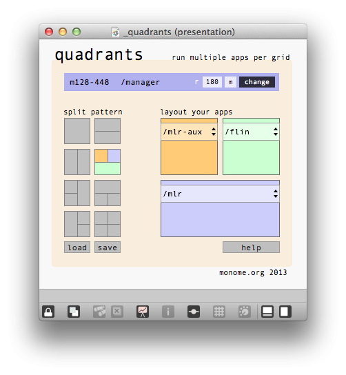

#quadrants 2

**created by:** galapagoose
**original version by:** bean

a device splitter to access multiple patches simultaneously

allows the user to attach a 128 or 256 and address up to 2 or 4 applications respectively. the device is split into 8x8, 16x8 or 16x16 grids with each area communicating with one application only. this version uses serialosc and does not require the zeroconf externals or bonjour to be installed on windows machines.

at present variable brightness commands are not supported. tilt sensor is available to the 1st (orange) app only. please report bugs to the forum post below.