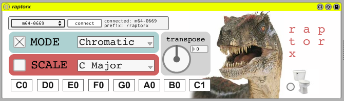

# raptor

raptor x (by pewt)

midi triggers + pattern recorders

the bottom seven rows are midi note triggers- you can change the scale and key with the menus. pretty standard midi keyboard replacement (like pitches or balron)

its the top row that makes things interesting- press any of the buttons on the top row and you open the gate to one of 8 loopers. recording starts when you play the first note, and the phrase loops in metrical time (you can set the intervals for each looper with the menus). a second press on the top row kills the loop

by alternating loop lengths, and creating phrases that trail and intersect, you can achieve some pretty nifty stuff...

ver 1.01 sacrifices the 8th pattern recorder for a mute switch: hold down the last button on the first row, the press the patterns you want to mute/unmute

ver 1.02 adds autofocus 

raptor x adds a bunch of stuff:

* chromatic scales

* musically literate scales

* custom scales

* the ability to change the loop length on the monome

* serialosc support

* flush button

* transpose function

video demo at: http://www.vimeo.com/11390373