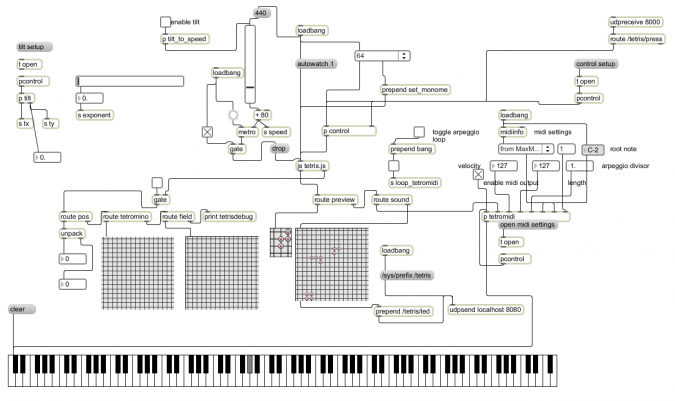

# Tetris

Tetris for the Monome platform.

created by: robb

## Features 

* 64, 128, 256 modes supported
* midi output
* two 256 modes (fullscreen or partial with tetromino preview)

## Controls

For 64 (experts only)
Top Row Buttons = Rotation
2nd Row Outer Left & Right buttons = Move Left & Right
Bottom Row = Move Down

All other sizes
Top Row = Rotation
Outer Left/Right Rows = Move Left & Right
Bottom Row = Move Down

https://www.youtube.com/watch?v=76aViLkzhAc