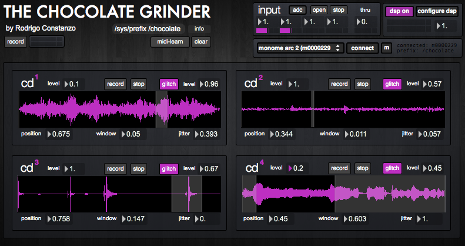

#The Chocolate Grinder

created by: [Rodrigo Constanzo](http://www.rodrigoconstanzo.com)

http://vimeo.com/36277452

Skipping/glitching CD player emulation for Arc2 or Arc2.

**Features:**

The Chocolate Grinder is a software emulation of a skipping/glitchy CD player. 
You can record (or drop a waveform) into a buffer and then define a playback/glitch window. 

It uses authentic skip/glitch samples at every jump point along with weighted randomness of sample choice to emulate several makes/eras of CD players.

The seek/fastforward is also faithfully recreated.

**Instructions:**

Each of the four modules functions the same way. You can record audio into the buffer (or drag an audio file onto the display area) and then you can control a glitch/playback window using position/window controls. 

Jitter adds some randomness to the position/window parameters relative to window size.

Glitch adds CD skipping noises on each jump.

**Arc Mapping:**

First press starts recording audio, with the next press stopping the recording.
Once audio is in the buffer pressing starts/stops audio playback. 
Turning effects position (via inertia/rotation) and press+turn effects window size.
Press and hold for 1second clears loop and starts the process again
