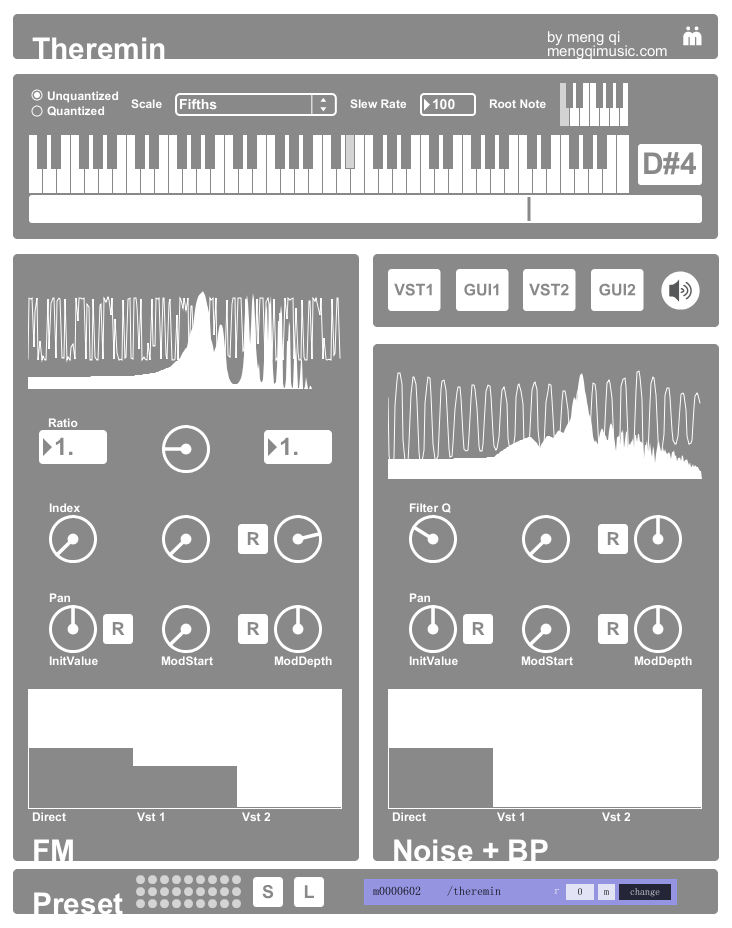

# theremin

theremin for monome arc2

created by: Meng Qi -- http://mengqimusic.com

2 knobs on arc : 1 for loudness/timber morph, 1 for pitch

2 sound sources : fm and bandpass noise

2 pitch modes : unquantized and quantized (thanks to ScaleMaster http://xfade.com/max/ScaleMaster/)

2 vst send effect

preset system saves everything inluding the vst plugin filepatch and settings

notice : please install scalemaster before use http://xfade.com/max/ScaleMaster/

tutorials
* left knob = initial value
* middle knob = from which knob position the timber morph begins
* right knob = mod depth (left is negative, right is positive)
* the [R] beside knobs will reset the corresponding knob to center