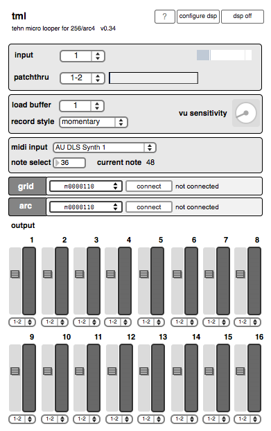

# tml[refactor]

## tehn micro looper for 64/128/256 and arc2/4 

 
created by: tehn, refactored by: stretta and tenmen 

* tml035 - standalone
* tml4l034 - max for live port

## discussion

* [http://archive.monome.org/community/discussion/13169/x](http://archive.monome.org/community/discussion/13169/x) [refactor]
* [http://archive.monome.org/community/discussion/11755/x](http://archive.monome.org/community/discussion/11755/x) [original]

## media

* [https://vimeo.com/43473260](https://vimeo.com/43473260)

## notes

max6 runtime compatible only

v.035 (tehn)

* added arc-key subpatch which maps keyboard Z X C V to arc-key for keyless arcs

v.034

* added momentary/latching record functionality
* ported to max for live

v.032

* added vu sensitivity dial in the ui
* increased the playback speed encoder range from 3x to 6x
* added adjustable gain and output channel for each voice

v.031

* fixed the LED feedback bug on 64/128 - thanks to r1v1era/flyingoctopus/watson
* added midi record functionality

## quickstart guide

* Select grid device and press connect button.
* Select arc device and press connect button.
* Enable DSP. DSP button should be lit yellow.
* Select input source. You should see input meter activity.
* Put voice one in focus. LEDs on arc should light.
* Press and hold record button.
* Adjust second encoder to raise voice volume. You should see meter activity on the grid.
* Adjust master volume.
* Adjust first encoder to select playback portion of buffer.

## interface layout

grid [64] [128]

* rows 1-5 - meter activity display
* row 1 - 2x playback speed
* row 2 - 0.5x playback speed
* row 6 - voice enable/disable button
* row 7 - voice record button
* row 8 - voice focus

grid [256]

* rows 1-13 - meter activity display
* row 1 - 2x playback speed
* row 2 - 0.5x playback speed
* row 14 - voice enable/disable button
* row 15 - voice record button
* row 16 - voice focus

arc

* encoder 1 - loop selection/press for loop length
* encoder 2 - volume lfo/press to zero
* encoder 3 - playback speed/press for 1x
* encoder 4 - voice volume/press for 40%
