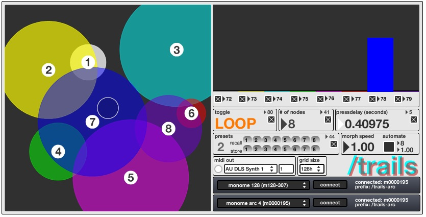
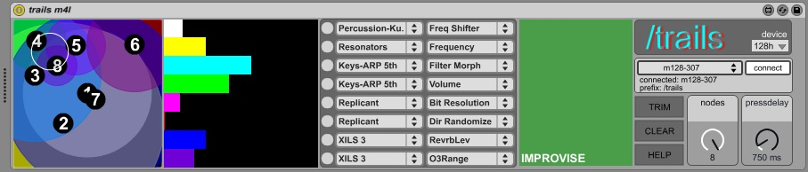

# trails

midi cc slash live parameter interpolation looper

created by: kramer

use your fingers to draw trails in any direction, to which the button depress is delayed a definable amount. users can have 1-8 nodes; a node is a circular, movable, resizable, 2D representation of a parameter you want to play. the closer you drag your fingers to a node's center the higher the value. changes can be recorded, looped and overdubbed, but not stored. depending on how many nodes you have enabled, their size and position - interpolation between parameters is unavoidable and typically unpredictable. as an example; you could have 1 node which could be like one knob, 2 could crossfade between your choice of parameters or you could activate a whole mess and see what happens. 

version 2 adds support for arc 2 or 4 as well external MIDI controllers, presets for nodes' size and position, preset morphing and automated preset switching. 

trails m4l screenshot

