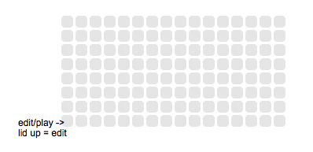
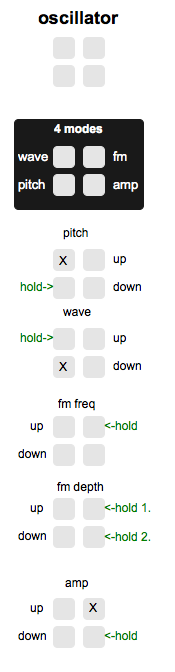
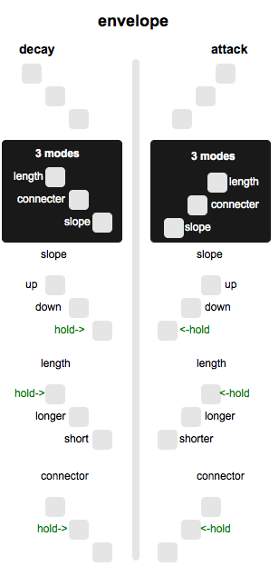
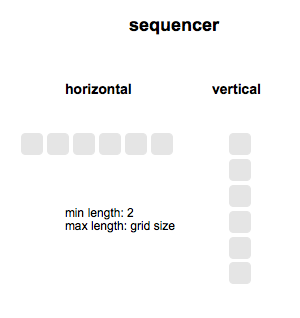

# triggers

http://vimeo.com/91878748

https://github.com/SorenAndreasen/triggers/releases
     

triggers is a flexible module-based synth environment. you start out with a blank grid and shape your interface the way you want it, by making operators in forms of different shapes.

requirements: monome 15-vari-bright, 64/128/256

recommended: 128/256

## edit/play  

* bottom leftmost button switches between play/edit mode
* edit mode: make/delete operators by pressing appropriate shapes
* play mode: interact with these operators by touching them as described below

## operators

### oscillator 

* x = not yet assigned
* pressing all 4 cells toggles mute on/off
* freemode: when holding a mode and a param button, releasing the mode button first will make the param dec/inc until stopped again.
  * stopping freemode is done by releasing the mode button last

### envelope 

the connector button

* while holding the connector button:
  * Pressing any of the 4 cells in an oscillator connects/disconnects the envelope to that parameter. active connections are displayed with a lid cell.
  * Pressing anywhere in a sequencer, places the envelope there
  * NOTE: envelope diagram in "help" in triggers is displaying incorrect positions. will fix with next update.

### sequencer 

* edit mode: exactly two presses in one line
  * can be horizontal or vertical
  * vertical and horizontals can overlap, thus triggering the same notes in the intersection 
* play mode:
  * 1 press: jumps to position
  * 2 presses: makes innerloope 
  * 3 presses: changes tempo

## credits

thanks to brian for letting me build upon a js for detecting shapes that he made

thanks to trent for inspiring conversations

thanks to kelli for useful feedback and an aeropress to keep me up at night

## features for 1.0

* arpeggi operator to do rapid pitch changes on oscsillators
* step presses will have finer quantization also on slow tempo
* envelope parameter visuals will have double the detail
* possibility to make merging sequencers' playheads enter each other
* combining envelopes
* LFO mode for oscillators
* sequencers can hold several envelopes in one cell
* when holding an envelope connecter, only that envelope's active cells will show up in sequencers
* visualization for param freemode if it's on
