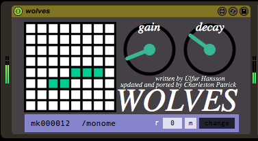

# wolves_m4l

make your inputs howl... now in live, with serialosc support.

created by: dataplex

updated and ported by: chrlstnptrck

this is an update and port of dataplex's lovely wolves patch, letting you howl and growl inside of live. the top row triggers chimes, made from sinusoidal peaks of the input signal. the next rows will do the same but also transpose each sinusoid by a harmonic interval.

drop it on a track.

play a recorded clip or input live audio.

turn up the gain.

begin howling.

https://www.youtube.com/watch?v=QdlDadzOIWE